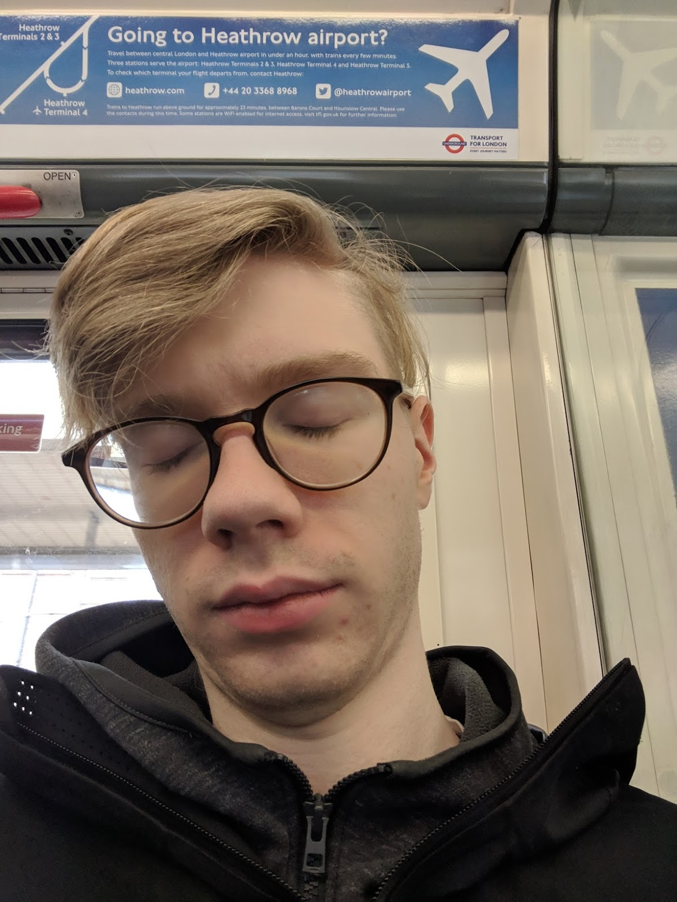
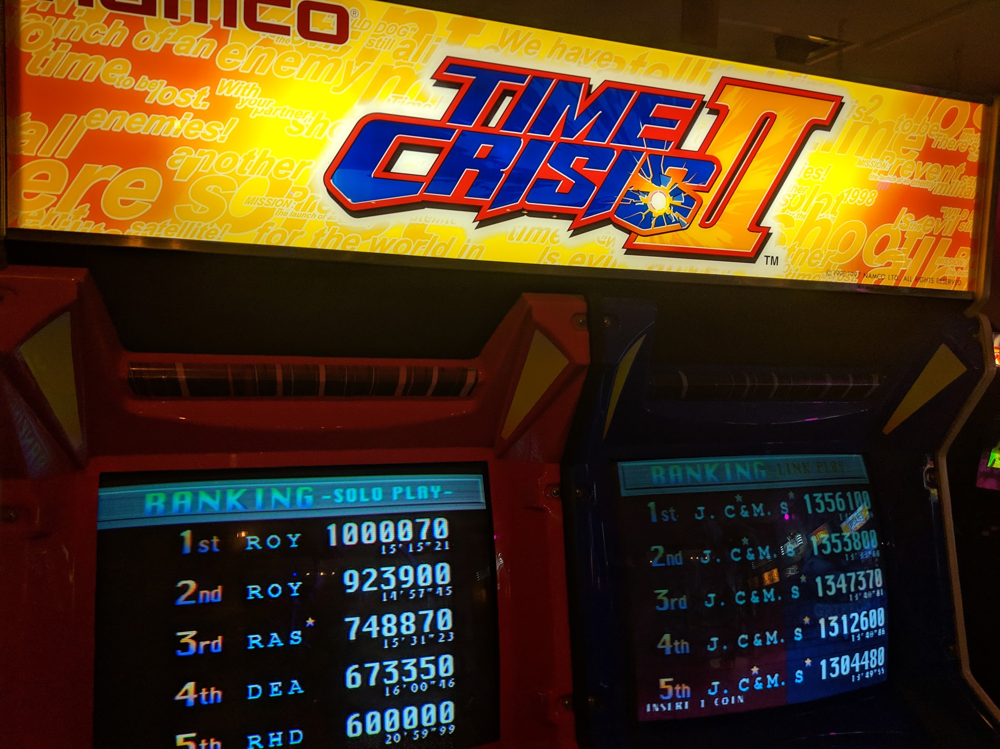
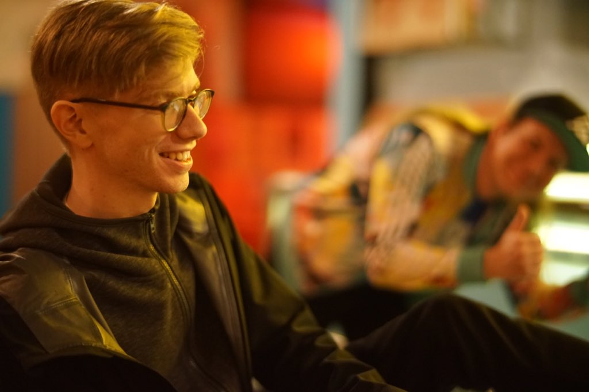
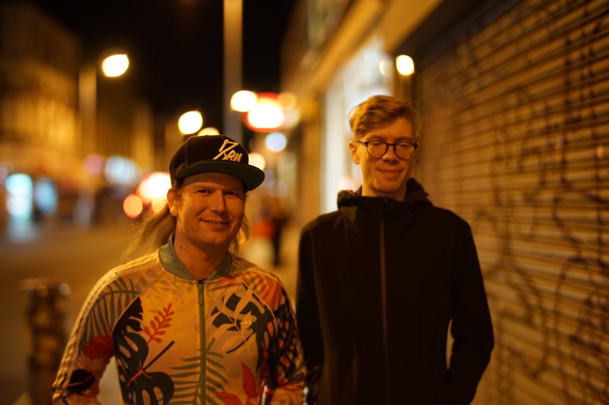

### Thursday, May 2

After a red-eye flight, I arrived in London Heathrow around 10am. I hadn't slept a wink, so I spent most of Thursday working to stave off jetlag. I headed up to my Airbnb in Islington on the tube, and probably fell asleep like three times.

Islington is an upscale residential area of London, and would have been very nice if the roads weren't under constant, hectic construction that led to me nearly getting run over like four different times just trying to get to the train station. I picked it because it was convenient to Ally Pally, where PROGRESS was, as well as the Overground, which I could take to see my friends in south London.

I got brunch at a place called Sawyer & Gray, which was an absolutely adorable cafe. Like, for the most part, I've removed the word "adorable" from my vocabulary when describing places, because it tends to make people think of Pinterest-core decoration and bullshit food presentation, but this was the opposite: a solidly down to earth cafe that just happened to be in an extremely quirky space. I failed to get photos, but it was split between a ground level and a basement level separated by a long staircase with a skylight, and I just found the whole setup delightful.

After hanging out for a couple hours, trying to not fall asleep, it was finally 3 and I could go check into my Airbnb. It was hosted by a woman named Sasha and her partner, who I only met very briefly one morning. Sasha was the exact mix of helpful and non-prying I hope for in an Airbnb host - someone who can tell me where I can get a good breakfast, but not inquire about every single thing I'm doing in my stay (explaining pro wrestling to people is hard!).

I took a jetlag nap, and then headed out to meet my friends tef and Daniel in Peckham. We met at a barcade, which I found mostly hilarious due to its use of _American quarters_ as tokens, as well as a giant Brooklyn Brewery sign.

We got dinner at Voodoo Ray's, a pizza joint, and I'd be lying if I said it wasn't the best fucking gluten free pizza I've had since I stopped eating wheat. It was also about half the price of the average 12" GF pie in NYC. tef took some excellent photos of me there and on the walk back to the trains, which I will include here because damn look at them!

### Friday, May 3

I spent Friday in a bit of a jetlag funk, which was rough since I was traveling around solo. Mostly, I needed to kill time, and wanted to visit some places I hadn't been before.