### April 2

Landing in Edinburgh was fine, though I was once again surprised by the lack of jetways. I was also surprised - though it's obvious in retrospect - that instead of going through international (EU) arrivals to the UK like I would have expected, there was a separate line for the soft border between Ireland and the UK. Felt weird arriving without getting a passport stamp, but hey, no lines!

I grabbed my luggage and hopped on the express bus to Edinburgh's center. Upon arriving, I was completely blown away by the - and I'll use this word a lot on this trip, between here, Venice, and Porto - the _topology_ of the city. Edinburgh is basically built around a huge hill upon which Edinburgh Castle sits, at the end of the main street of its Old Town. The Old Town rises far above the area around it, including where the bus dropped me off, on one of the main streets of the New Town. The new town is big and flat, and full of modern shopping and retail brands, while the Old Town is the tourist center and full of shops where you can buy tartans and whatnot.

The first view off the bus was ridiculous, though I poorly captured the scale of it here:

This is the view of Princes Street Gardens, which is a huge valley between the New Town and the Old Town. The buildings in the background are essentially the north edge of the Old Town. I was heading towards my hostel, so I walked up [The Mound](https://en.wikipedia.org/wiki/The_Mound), an artificial hill built in the valley that serves as a bridge between the New Town and the Old Town.

Edinburgh has a lot of tiny pedestrian streets, with steep stairs running down alleys through buildings. Google Maps thankfully knows about these little paths, and gives pretty great walking directions that get you places much faster than following the roads would.

The stairs took me right up to the Royal Mile, the main street of the Old Town.

At this point, I realized I was incredibly, hungry, and before heading to my hostel, I headed over to Oink, a pork sandwich shop that's a local chain that came highly recommended.

With sandwich in hand, I headed back up to the hostel, which I found was, well, as advertised:

The hostel was probably the best-located I stayed at on my trip, and also just one of my favorites. It was rather cheap - 25 GBP a night for a 6 bed room - and had a solid kitchen, social events every night, and mostly friendly people. My room had a comfy bed and a great view of the castle.

The weather, if you hadn't noticed from the pictures, was pretty miserable, but I wanted to wander around at least a bit, so I walked down the Royal Mile and looked at some of the tourist shops. On the way back up, I went in a little tourist tavern and had "haggis bonbons," which were honestly pretty good!

I hung out at my hostel for a few hours, then found myself hungry again. Luckily for me, there was a 24/7 kebab shop nearby, though getting there was hilarious. The hostel is built into the side of a cliff, and while the street level entrance is on the top of the cliff, the kebab shop was at the bottom on the other side of the building. Turns out, there is a _massive_ staircase just to the left leaving the hostel that takes you down to the bottom of the cliff, and the kebab shop. Getting down was easy, getting up was rough.

Then I went out with folks I'd met at the hostel for hostel-organized pub trivia. The pub kinda sucked, and the trivia was really bad, but we got a free drink, so eh. We also walked to a place next door advertising free live music, where we found... a band doing a folk cover of Toto's Africa. It was an appropriately surreal way to end the night.

### April 3

The next morning, I grabbed a very good bacon roll and a very bad flat white at the cafe a couple doors down from the hostel.

My goal for the day was to go to Edinburgh Castle, which, uh, ended up being not very ambitious, considering it was all of a 3 minute walk up a staircase from my hostel, just out of frame to the right in the below picture:

The big, flat lot in front of the castle gave some beautiful views of the surrounding area. Below is looking back at my hostel (the last building on the street below) and [Arthur's Seat](https://en.wikipedia.org/wiki/Arthur%27s_Seat) behind it. This was the first time I'd gotten a proper view of Arthur's Seat, and after realizing its sheer scale, I was suddenly glad that the weather would be too cold and wet for me to attempt climbing it.

On into the castle itself! It was a quite steep £17 to enter, and I wasn't sure I'd get my money's worth. The castle itself isn't really preserved as it was in the 12th century, or even as it was when last occupied by royalty in the 17th. What's there now is a mix of museum and historic site, reminding me a lot of Hampton Court Palace in England.

Once inside the castle, a long road with a couple switchbacks takes you up to the central square. I grabbed an audio tour (which cost a few extra quid) and started following it up the road.

The first thing it did was take me to the most crowded exhibit of the whole thing: an exhibition of [Scotland's crown jewels](https://en.wikipedia.org/wiki/Honours_of_Scotland). I've got no pictures of this, because the exhibit was pretty dim and you're not allowed to take photos of the jewels themselves. There's a looong exhibit leading up to the jewels that explains their history and significance, but as a very clueless tourist who hadn't yet even glanced at a Wikipedia page about Scotland's history, I kinda struggled to follow along. The jewels themselves were, well, a crown, a sceptre, and a sword, which all date from around 1500. It was neat, but by the end I was glad to be away from the crowds.

Next was the Great Hall, which is a rather impressive room. The Hall was originally built in the 16th century for state assemblies, but was converted to a barracks by Cromwell, and continued to be a barracks, and then a military hospital, before it was restored around 1900. Today, the only original part of the Hall that remains is the wooden roof, but a variety of arms and armor are displayed there.

Back outside, I ventured into the Scottish National War Memorial, originally a barracks built in 1755. It was originally converted to a memorial for soldiers who died in World War I, but now memorializes all Scottish soldiers who have died in conflicts since then.

More stairs took me up to another courtyard with the highest views you can get of the surrounding area, including a beautiful view of Arthur's Seat:

In the courtyard was [St Margaret's Chapel](https://en.wikipedia.org/wiki/St_Margaret%27s_Chapel,_Edinburgh), the oldest surviving building in Edinburgh. It is a _tiny_, unsassuming building, but there's something special about knowing that you're in the oldest surviving structure for miles around you.

I suddenly heard a loud _boom_, and realized I'd just missed the firing of the [One O'Clock Gun](https://en.wikipedia.org/wiki/Edinburgh_Castle#One_O'Clock_Gun):

I stopped in a little gift shop inside the castle for a free whiskey tasting, then headed onto the prisons of the castle. I got a beautiful view of New Town, across the Princes Street Gardens:

I had assumed the prisons would just be your normal, museum-ified castle dungeons, but was surprised to find out they'd been used as recently as the first world war. The first part of the prisons were some recreations of the common cells. Although it was a straight path through the exhibit, there were locked off doorways and gates everywhere, and I can only imagine how huge the whole complex is.

After walking through the cells, further exhibits detailed the history of the prisons and the prisoners there. They even had an original door with graffiti from the 18th century carved in it:

Having had my fill of the castle, I decided to head to the National Gallery of Scotland next. The Gallery is along The Mound, so rather than retrace the path I took when I got off the airport bus, I decided to walk through Princes Street Gardens to get to it.

Tracing the slippery path down from the castle gave me flashbacks to Howth, but thankfully, there were far fewer puddles along the way. I followed switchbacks down into the gardens, then took a steep staircase up to the street I'd walked up yesterday, right in front of the National Gallery.

The Gallery is split into two buildings, with an underground walkway connecting them. The closer building in the picture is the permanent collections, where I spent my time, while the further one contains temporary exhibitions, most of which cost money.

The Gallery was huge and I spent a ton of time there, though I'll admit I didn't like it as much as I should have because at this point I was _hungry_. As usual, being pretty plebian in my art appreciation, I ended up just loving all the landscapes.

Finally defeated by my hunger, I left and wandered into New Town, but found myself at a loss for what to eat: there was actually _less_ fast food than I expected, and a lot of tourist traps that looked to basically be Scottish Applebees. Instead, I wound up walking back to my hostel to eat my kebab leftovers. I did walk up around the other side of the castle, though, giving me a different view.

Back at the hostel, I just hung out there for the rest of the night, eating my kebab and later some takeaway fish and chips. While there was a ghost tour of some sort organized by the hostel, I declined due to the cold and wet and decided to get a solid night's sleep for once.

### April 4

For the third day in a row, my plans to do a free walking tour of the city were scuttled by rainy, cold weather. I got my third full breakfast of the trip as a consolation prize, from the same nearby pub where I had gotten fish and chips. It was a solid fry-up, and included haggis as a fun bonus.

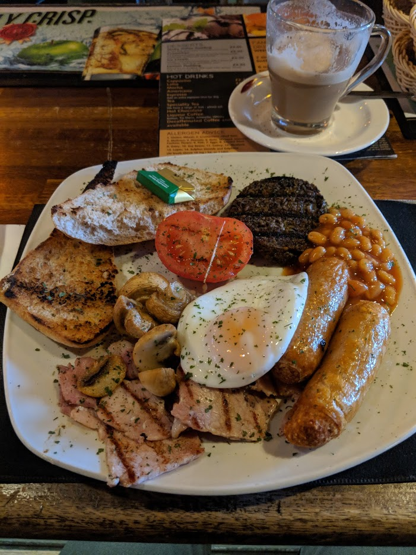

With no real desires other than to spend the day indoors, I braved the weather long enough to walk to the nearby National Museum of Scotland. On the way, I passed the statue of [Greyfriars Bobby](https://en.wikipedia.org/wiki/Greyfriars_Bobby) one of the most famous good dogs in the world.

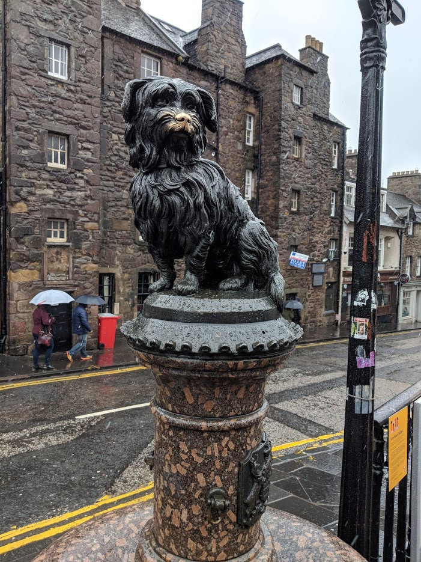

The National Museum of Scotland ended up being one of my favorite museums of the entire trip. The museum is a merger of two adjacent museums, with very different characters. The former Royal Museum dates from the 1850s and focuses mainly on science, world cultures (re: stuff stolen from other places), and natural history. After emerging from the basement entrance, I found myself in the crowded and loud main atrium.

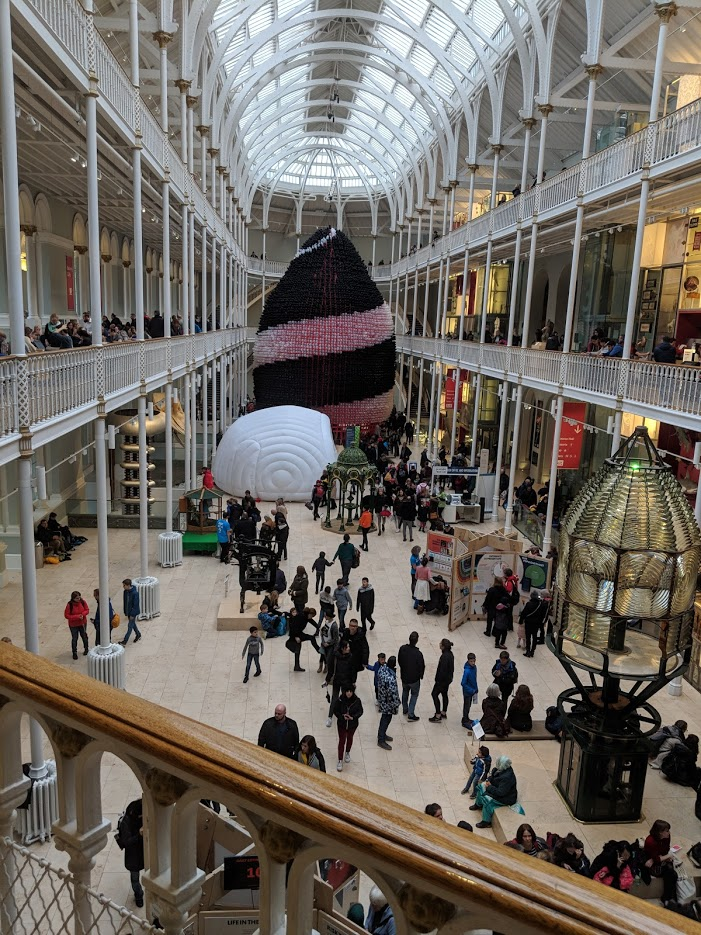

The atrium was full of temporary exhibits for the city's science festival, starting that week. The most interesting of these was a huge balloon sculpture, apparently representing an event horizon, though I'm not exactly sure how. It was still under construction when I was there, so they were filling out the bottom rungs of the sculpture, and occasionally a loud *pop* would echo across the atrium when someone over-inflated a balloon.

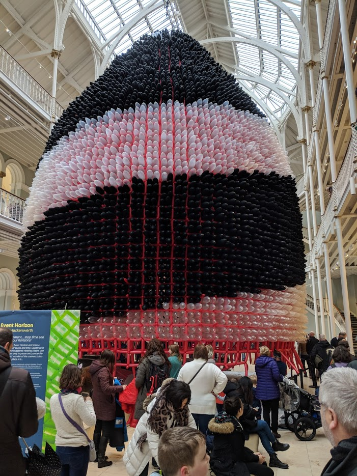

Given that there are science and natural history museums just about everywhere in Europe, I decided to skip past a lot of the exhibits and beeline towards the newer half of the museum, formerly just called the Museum of Scotland, which focuses on Scottish history and antiquities. I'd really loved the archelogical museum in Dublin for focusing on Irish history, and figured I'd find this interesting for the same reason.

On the way, I walked through another atrium devoted to science. I stopped at a few displays and that caught my eye, including some F1 cars, planes, and, uh, the taxidermied Dolly the sheep.

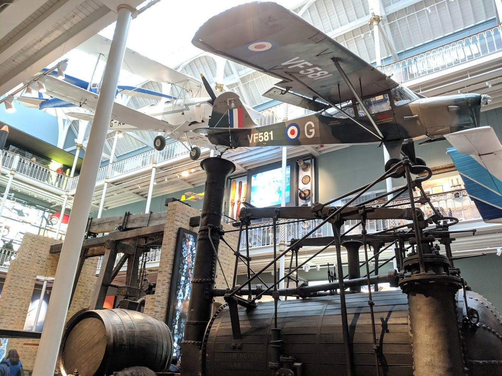

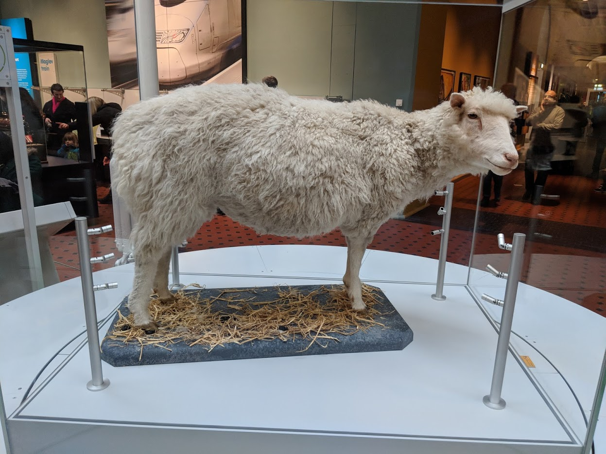

I finally made it to the Scottish history wing, where I remained for the next couple hours, tracing from pre-history through the Acts of Union. I *loved* this. I don't have a ton of pictures, because, well, my favorite parts were probably the detailed explanatory texts that walked me through the history of Scotland. The artifacts on display ranged from piles of millenia-old iron trinkets, to bibles printed during the Reformation, to famous arms and armor.

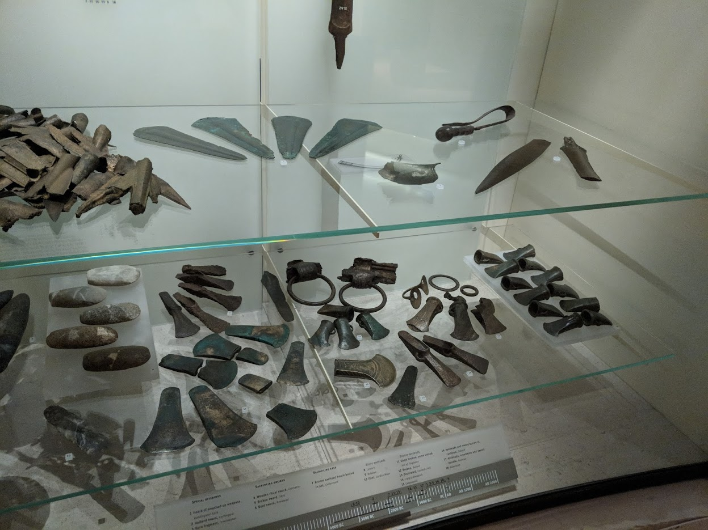

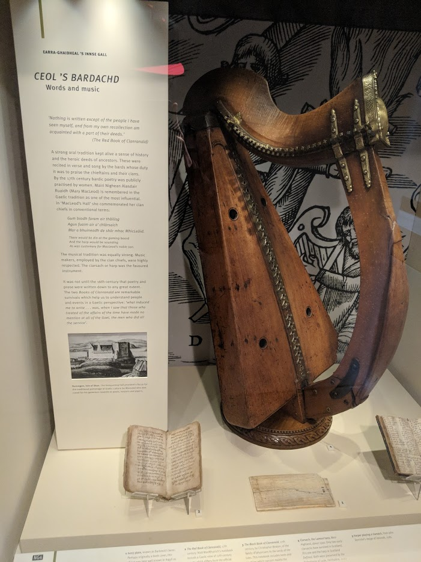

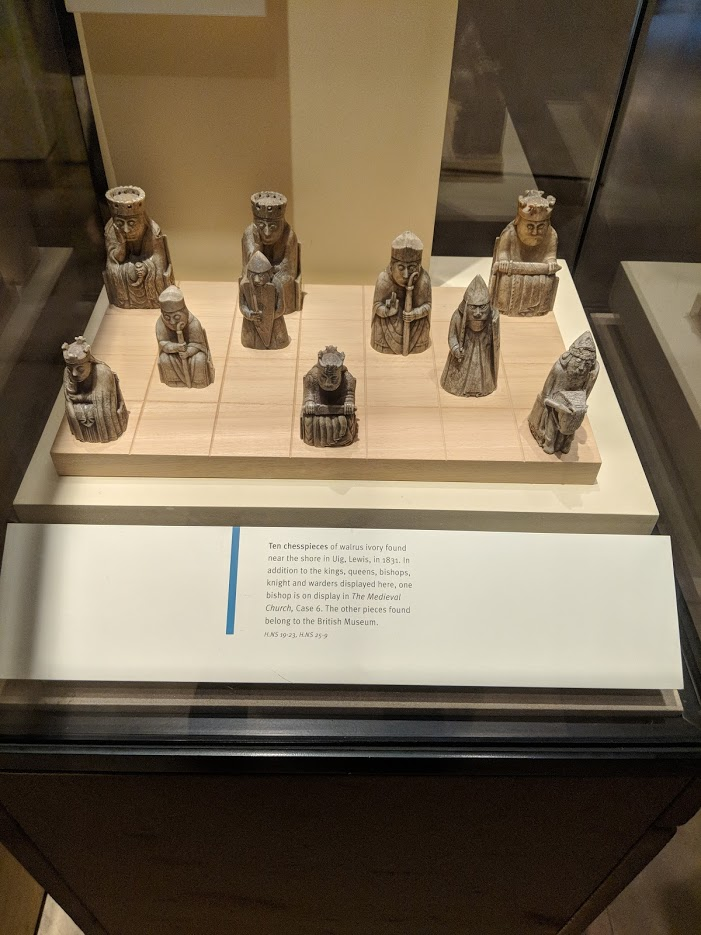

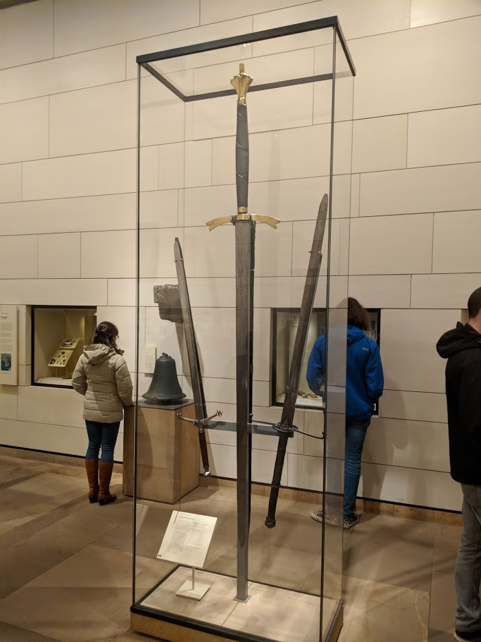

Eventually, my hunger overpowered my attention spawn, and I opted to skip the last 300 years or so of Scottish history in favor of finding lunch. I went to a tiny pub, the [Halfway House](https://www.tripadvisor.com/Restaurant_Review-g186525-d1516350-Reviews-The_Halfway_House-Edinburgh_Scotland.html), hidden halfway down a long staircase leading up from The Mound.

The pub was more or less the only time in my entire trip that any locals interacted with me on their own accord, with several older dudes at the bar who seemed genuinely happy to talk to tourists. I ended up sitting drinking for a _while_ after I'd finished my beef stew, listening to an older man go on and on about every band that came on the generic-classic-rock radio. The highlight of this was a story about how he had gone to seen Bowie in the 80s, and spent the whole time wishing he'd gone to see _Big Country_ play that night instead, which... I love Bowie, but also could understand his 80s shows being a bit underwhelming if you don't love [giant glass spiders](https://en.wikipedia.org/wiki/Glass_Spider_Tour). Also, hey, In A Big Country rules, so can't fault him too much.

After he stumbled out of the pub, yelling behind him that I should try listening to The Faces (which I did!), I decided to head back to the hostel myself. Several pints and two scotches later I was _quite_ tipsy for 3pm, and was displeased to discover it had started _snowing_ while I had been sitting inside. I slipped and slid my way uphill back to my hostel - no easy feat, given the shoes I was wearing - but made it back and immediately took a nap.

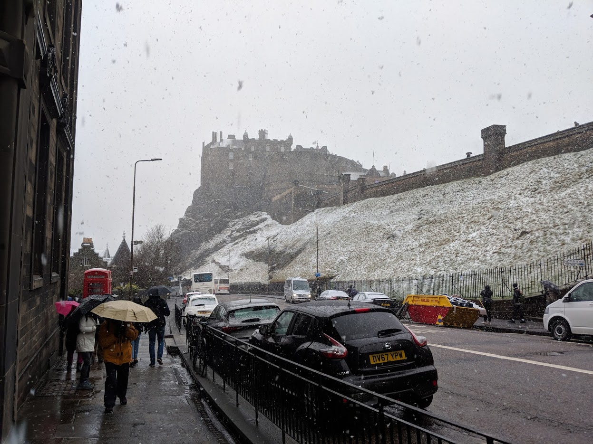

Re-energized, I headed back out with folks from the hostel to a hostel-organized "dance night," which turned out to be traditional dancing at a local rock club. I didn't partake, because I am historically godawful at any sort of dance requiring _choregraphy_, and didn't want to step on anyone else's feet (or bonk our heads together). Still, it was fun to watch.

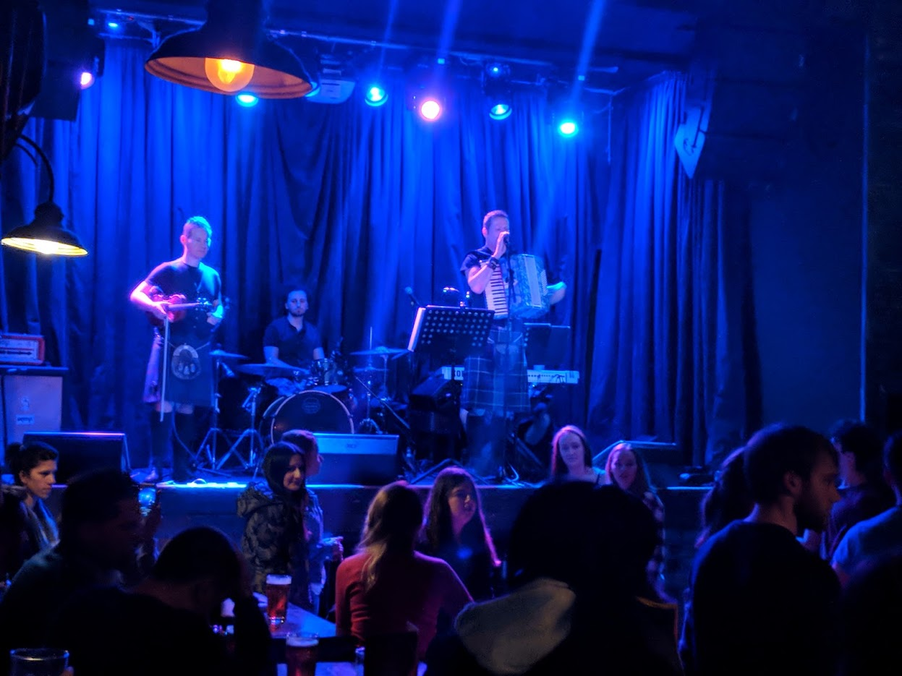

<iframe src="https://drive.google.com/file/d/1QeC-6NBGyd2_jzWuZZjzf6n_qG-PI1z_pQ/preview" width="640" height="480"></iframe>

I ended up hanging out with a few folks from the hostel, one of whom had been a university student here, so we all followed her to a nearby pub that was packed that night. The pub had a duo playing live music, all just pop covers in a vaguely folk-ish style. I could have done without having to hear Hey There Delilah ever again in my life, but their version was at least tolerable.

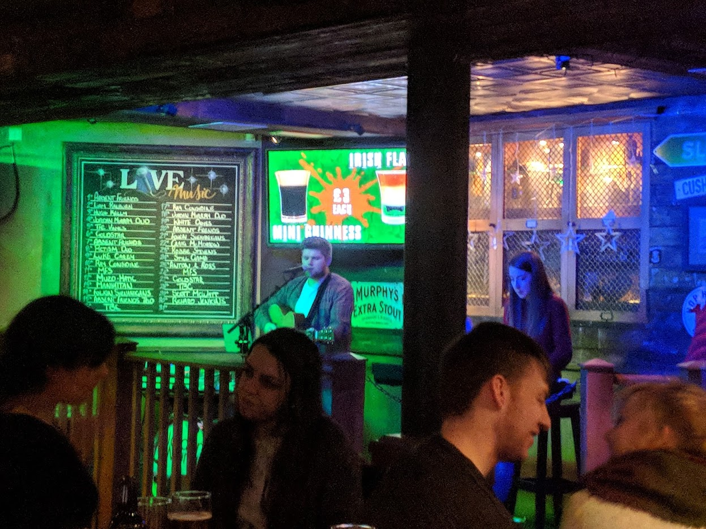

Then I headed back to the hostel for a decent night's sleep, before my long train trip to London the next day.

### April 5

Of course my last day in Edinburgh was the first day with a beautiful blue sky, but I already knew I wanted to come back here anyways. I headed down to the train station (located down in the same valley as Princes Street Gardens), where I picked up my ticket, ate a quick breakfast, and hopped on the train.

