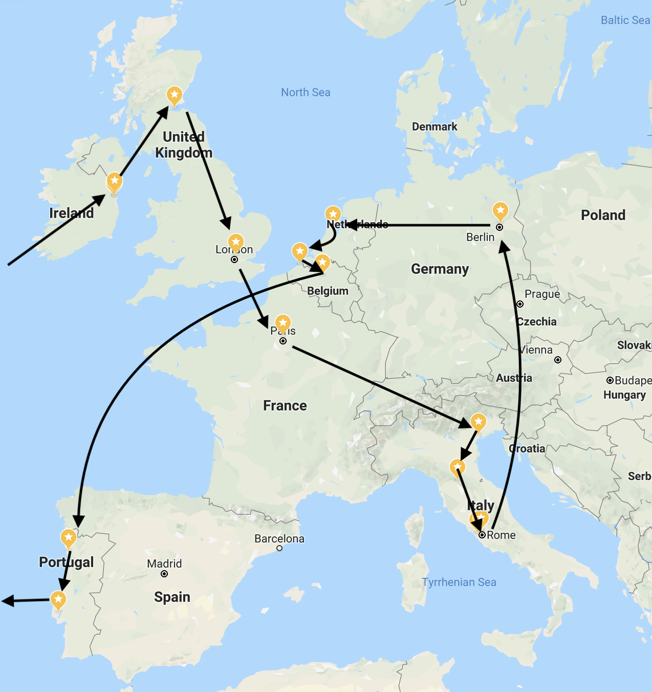
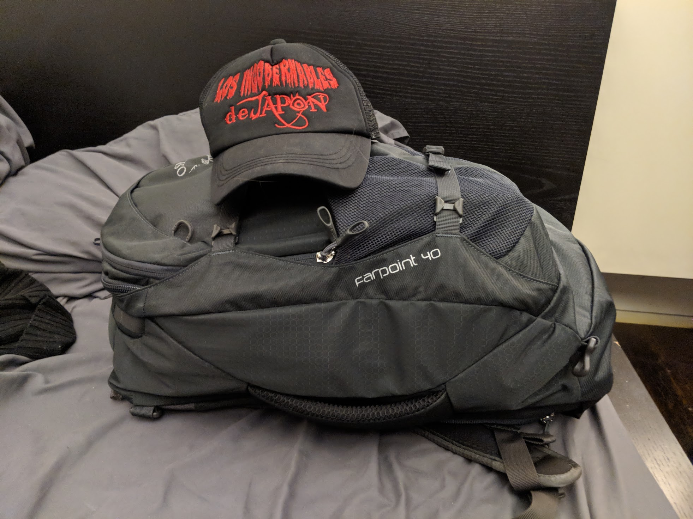

In 2017, I finally got my passport, and visited London for a couple weeks as my first big international trip. I wanted to do a lot more, so I started thinking about doing a bigger Europe trip. A few months later, I bought a ticket to [A MAZE](http://www.a-maze.net/events/amaze-berlin.html), a games conference happening in Berlin in April, and started considering a larger trip around it.

It took a couple months of planning to come together. I knew I wanted to start in Dublin, since it was a close flight (and I hate flying). I also knew I wanted to end in Lisbon, since I had a friend who'd be there in mid-May, and also Eurovision would be happening. And, of course, I knew I had to be in Berlin in mid-April. Figuring out exactly where to go in between took a lot of false starts, but I eventually settled on:

* Dublin (5 nights)
* Edinburgh (3 nights)
* London (4 nights)
* Paris (6 nights)
* Venice (2 nights)
* Florence (3 nights)
* Rome (4 nights)
* Berlin (6 nights)
* Amsterdam (4 nights)
* Bruges/Ghent/Antwerp/Brussels (3 nights)
* Porto (2 nights)
* Lisbon (6 nights)

Or, as illustrated:

There were lots of other places I could have potentially gone to, but with a trip this complicated, it generally came down to money, time, and price. For example, I wanted to go to Switzerland, but that is an _expensive_ country, and was warned that the weather is way too unpredictable in April to be there for only a couple days. And now, after this trip, I have so many ideas for follow-up vacations: I want to see the south of France and Spain, and the smaller villages and countryside of Italy, and the west coast of Ireland, and, like, _any_ of Scandinavia.

I had the trip pretty much entirely locked in by the beginning of February. Once I had my hostels, Airbnbs, trains, and planes booked, I kinda just sat back and relaxed. In retrospect, I wish I had done more planning - especially on the later parts of my trip, where I just could not be bothered to research what to do half the time. In particular, I kinda wish I'd just watched some Youtube videos about the places I was going, or at least looked up a few nice-looking cafes. Things worked out, but not _all_ cities are amenable to planning-on-the-fly, especially as a solo traveler.

I bought a few things for this trip - a day pack, a packable towel, and this Osprey backpack, which I carried all my stuff in. It's basically the largest bag you can bring carry-on on European budget airlines. It fit:

* Six days worth of t-shirts and underwear
* Two pairs of sweatpants
* Two pairs of jeans
* A fleece jacket (this was bought in Ireland, since I realized the hoodie I had worn on the flight wouldn't cut it)
* Toiletries
* Chargers, travel adapters (three separate ones for England, Italy, and the rest of Europe), a locker padlock, spare glasses, and other random small things
* Macbook
* Nintendo Switch
* A rain jacket

For most of the trip, though, I offloaded the last three things into the daypack while I was traveling, since otherwise it was way too heavy (and, uh, bulging significantly over the actual carry-on size maximums of every airline). I actually got a _packable_ daypack, which folded down into a small pouch, because I was flying EasyJet from Rome to Berlin, which _does not allow a personal item in addition to your main bag_ like all other carriers.

I took this image, fully packed for the first time, before leaving for my flight from JFK:

This travelogue is pieced together from a mixture of notes I took while traveling (though, unfortunately, I wasn't disciplined to keep a running journal for more than the first couple weeks), photos, videos, and tweets.